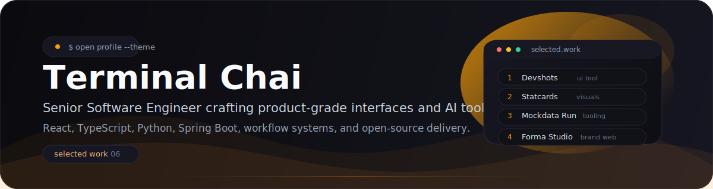
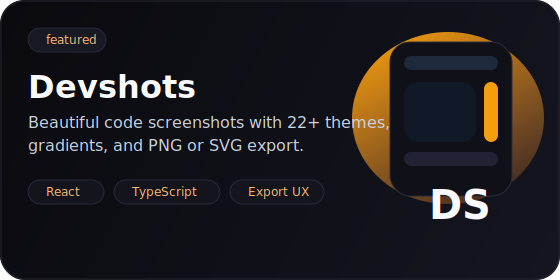
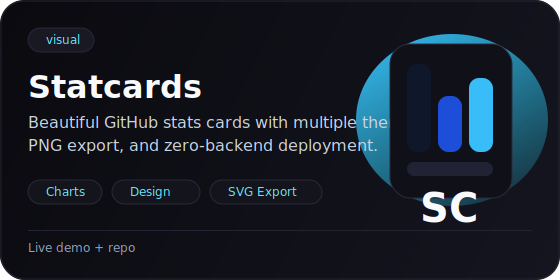
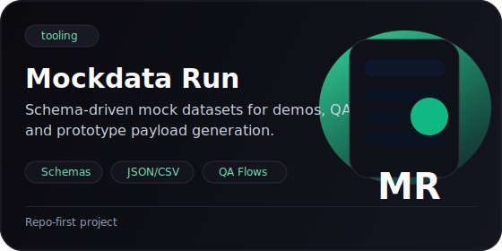
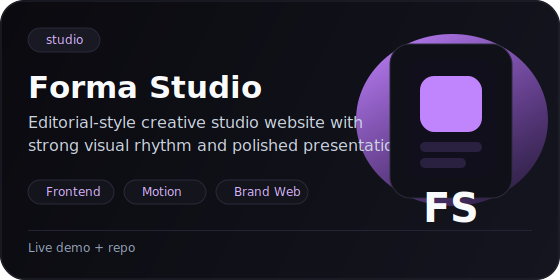
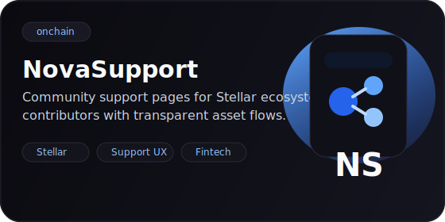
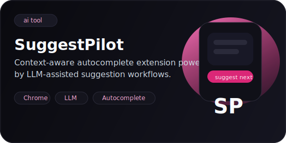

# Terminal Chai

  

  
  
  
  

  <code>React</code>
  <code>TypeScript</code>
  <code>Python</code>
  <code>Spring Boot</code>
  <code>AI Tooling</code>
  <code>Open Source</code>

  Senior Software Engineer building product-grade web apps, developer tooling, workflow systems, and AI-assisted platforms.

  I ship sharp interfaces, dependable backend systems, and AI workflow tools built for actual developer use.

## Snapshot

<table>
  <tr>
    <td width="50%">
      
    </td>
    <td width="50%">
      
    </td>
  </tr>
</table>

  

## Selected Work

<table>
  <tr>
    <td width="50%">
      
      
<a href="https://devshots-phi.vercel.app">Live</a> | <a href="https://github.com/terminalchai/devshots">Repo</a>

    </td>
    <td width="50%">
      
      
<a href="https://statcards.vercel.app">Live</a> | <a href="https://github.com/terminalchai/statcards">Repo</a>

    </td>
  </tr>
  <tr>
    <td width="50%">
      
      
<a href="https://github.com/terminalchai/mockdata-run">Repo</a>

    </td>
    <td width="50%">
      
      
<a href="https://forma-studio-flax.vercel.app">Live</a> | <a href="https://github.com/terminalchai/forma-studio">Repo</a>

    </td>
  </tr>
  <tr>
    <td width="50%">
      
      
<a href="https://nova-support.vercel.app">Live</a> | <a href="https://github.com/terminalchai/NovaSupport">Repo</a>

    </td>
    <td width="50%">
      
      
<a href="https://chromewebstore.google.com/detail/jephdljbbfhdmgbpbpjddcgjmofhnkan">Store</a> | <a href="https://github.com/terminalchai/SuggestPilot">Repo</a>

    </td>
  </tr>
</table>

## Open Source Proof

- [plotly/dash#3723](https://github.com/plotly/dash/pull/3723)
  Fixed misaligned `dcc.Slider` marks when empty labels are used and added a regression test.

- [jupyterlab/jupyterlab#18714](https://github.com/jupyterlab/jupyterlab/pull/18714)
  Added a CSV comment-character option with package-level build and test validation.

- [jupyter-server/jupyter_server#1611](https://github.com/jupyter-server/jupyter_server/pull/1611)
  Fixed outdated `ContentsManager` testing documentation.

- [skrun-dev/skrun#6](https://github.com/skrun-dev/skrun/pull/6)
  Added `--force` support across CLI, API, and tests.
